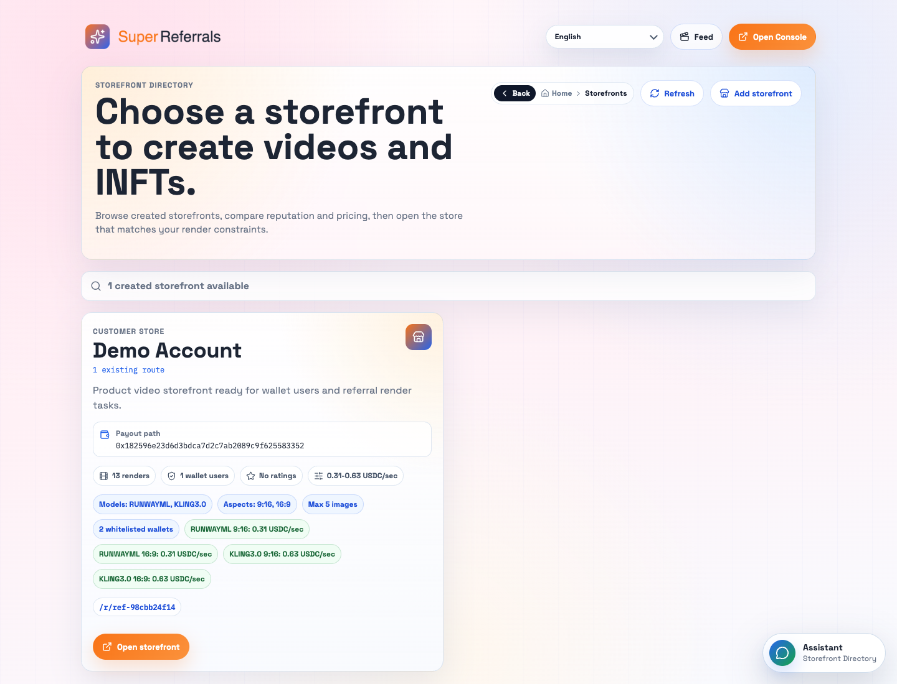
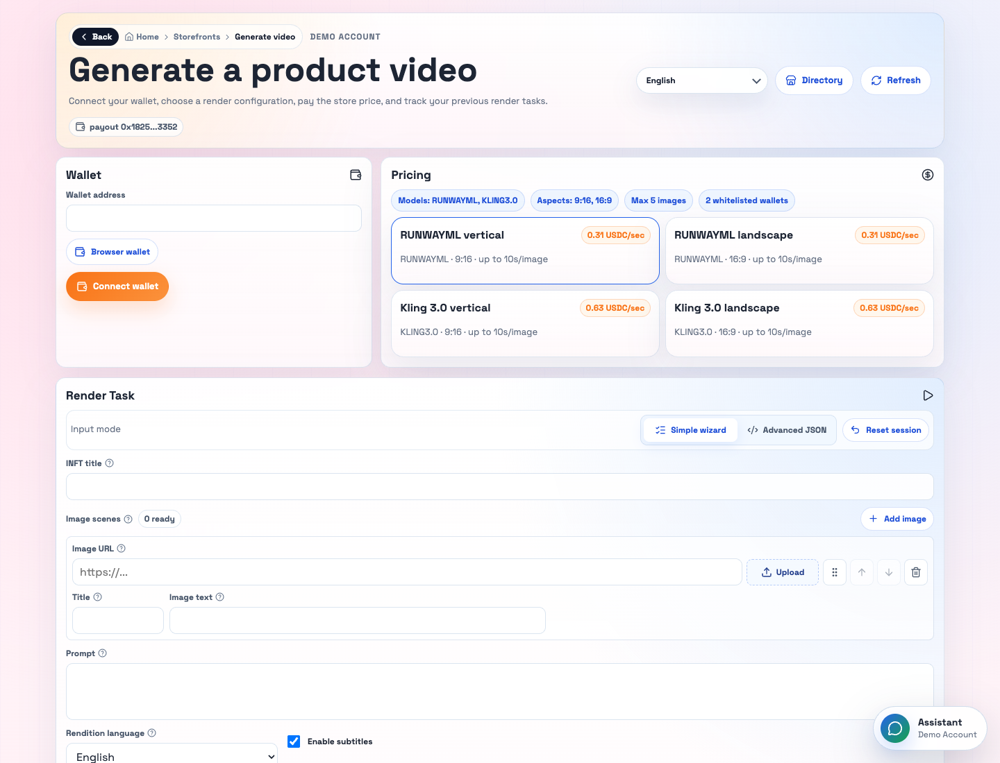
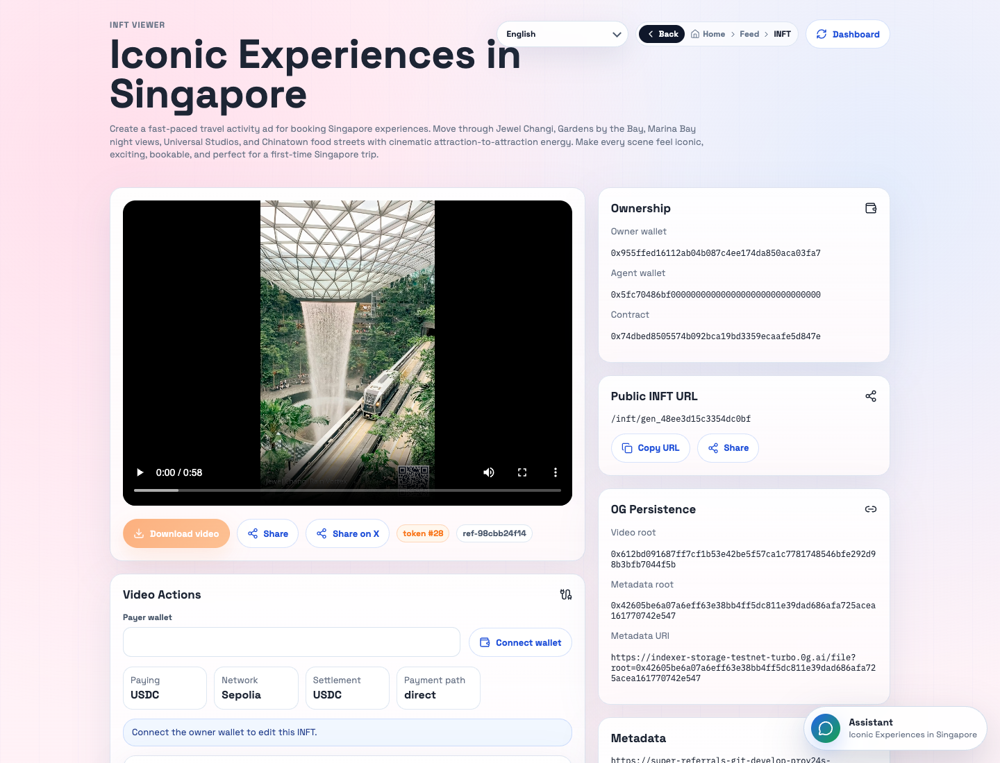
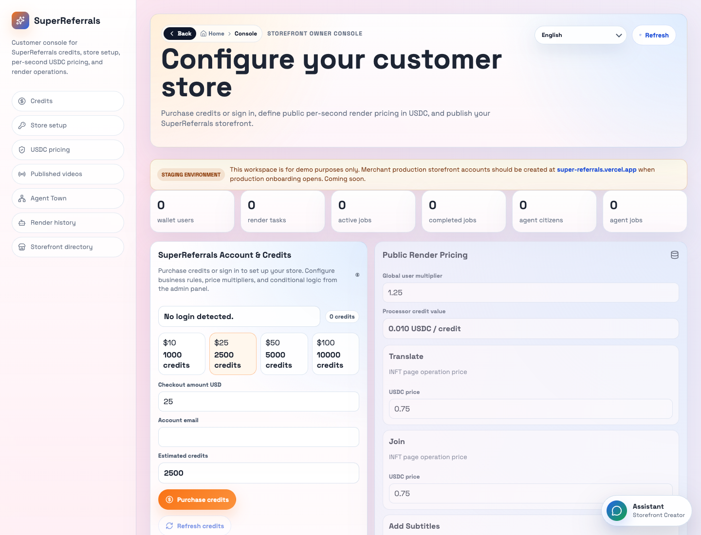

# SuperReferrals

<p align="center">
  
</p>

<p align="center">
  <strong>Turn referral links into product videos and editable iNFTs.</strong>
</p>

<p align="center">
  Give every recommendation a product story, visual style, QR-ready call to action, and auditable onchain video record.
</p>

<p align="center">
  <a href="https://super-referrals-git-develop-proy24s-projects.vercel.app/">Live staging</a>
  · <a href="#quick-tour">Quick tour</a>
  · <a href="#view-map">View map</a>
  · <a href="#run-locally">Run locally</a>
  · <a href="docs/ARCHITECTURE.md">Architecture</a>
</p>


SuperReferrals replaces bare tracking links with storefront-controlled video generation. A storefront owner configures products, models, pricing, wallet access, and render policies. A creator or buyer opens a storefront or referral route, connects a wallet, pays the quoted price, generates a product video, and receives a public iNFT record that can be shared, copied, translated, edited, and audited.

The app is built for crypto-native referral commerce: catalog-driven videos, storefront-controlled pricing, EVM payment verification, KeeperHub settlement, optional Uniswap routing, Samsar video generation, 0G storage/compute, and public feed discovery.

## Live Staging

Use this deployment for hackathon review and product testing:

[https://super-referrals-git-develop-proy24s-projects.vercel.app/](https://super-referrals-git-develop-proy24s-projects.vercel.app/)

The current staging deployment includes a demo storefront, a referral route, completed renders, public feed items, and iNFT pages. Read-only pages work without a wallet. Rendering, copy purchases, and paid edits require a browser wallet on the configured payment network and must satisfy the storefront's wallet access policy.

Screenshots in this README were captured from live staging on 2026-04-30.

## What It Is

SuperReferrals is organized around three audiences:

| Audience | What they get |
| --- | --- |
| Storefront owners | A console to publish video storefronts, buy credits, link payout wallets, set render rules, choose models, price videos and iNFT actions, and inspect render/agent history. |
| Creators and buyers | A public storefront or referral page where they connect a wallet, build a product video from images, catalog metadata, prompts, CTAs, and language settings, then pay and track the render. |
| Hackathon judges and developers | A full-stack reference flow across Next.js, Samsar video generation, EVM payments, KeeperHub settlement, 0G storage/compute, iNFT records, assistant UX, and agent receipts. |

## Quick Tour

### 1. Start from a storefront

The storefront directory lets users browse public storefronts, compare model limits and pricing, and open the storefront that matches their render needs.



### 2. Generate a product video

The public creator page supports wallet connection, storefront pricing, simple wizard mode, advanced JSON mode, image uploads, product metadata, prompts, language/subtitle settings, CTA outro/footer options, feed publishing, and copy-purchase settings.



### 3. Browse the public feed

The feed is a public discovery surface for completed renders. It supports mobile and desktop layouts, deep links to specific renders, language filtering, views, likes, comments, share links, and a page assistant.


### 4. Inspect and edit the iNFT

Every completed render can be opened as a public iNFT page with playback, ownership metadata, 0G persistence records, share actions, copy purchase, owner-gated download, and paid edit operations such as retranslation, subtitle updates, outro updates, and footer updates.



### 5. Manage the storefront

The owner console is where storefront owners purchase credits, connect their owner wallet, configure public storefront details, set USDC pricing, control model/aspect/image limits, manage wallet allowlists, review videos, run Agent Town, and inspect render history.



## Core Flow

1. A storefront owner opens `/dashboard`, connects or creates a Samsar-backed account, buys credits if needed, connects an owner wallet, and publishes a storefront.
2. The owner chooses allowed video models, aspect ratios, max images, wallet access mode, daily limits, and pricing.
3. A creator opens `/storefronts`, `/storefronts/:customerId`, or `/r/:referrerCode`.
4. The creator connects a wallet and creates a render from product images, listing metadata, prompt direction, CTA URL, language, and publish settings.
5. The app quotes payment in the selected token and verifies the mined transaction before starting the render.
6. Samsar generates the video. SuperReferrals stores render metadata, publishes feed/iNFT records when requested, and writes 0G persistence references when live providers are configured.
7. The completed video appears on the creator's storefront history, the public feed if published, and `/inft/:id`.
8. Owners or purchasers can run paid iNFT operations exposed by storefront pricing, including retranslation, subtitle updates, outro updates, and footer updates.

## View Map

| View | Route | What it does |
| --- | --- | --- |
| Landing page | `/` | Explains the product, shows the campaign flow, links to the console, storefront directory, feed, and latest video, and embeds the page assistant. |
| Storefront owner console | `/dashboard` | Storefront setup, Samsar account/credit purchase, owner wallet linking, public pricing, model rules, allowlists, published videos, Agent Town, and render history. |
| Storefront directory | `/storefronts` | Lists public storefronts with pricing, render limits, wallet policy, rating summary, render count, route links, and open-store actions. |
| Storefront creator | `/storefronts/:customerId` | Direct public storefront page for creating product videos and iNFTs from a selected storefront. |
| Referral creator | `/r/:referrerCode` | Referral-specific creator route with the same generation workflow plus referrer attribution. |
| Public feed | `/feed` | Public video gallery with mobile/desktop modes, search, language filtering, playback controls, likes, comments, and assistant. |
| Focused feed item | `/feed/:generationId` | Opens the feed focused on one generation. |
| Focused feed mode | `/feed/:generationId/:viewMode` | Opens one generation in `mobile` or `desktop` feed mode. |
| iNFT viewer | `/inft/:id` | Public render ownership page with video playback, owner-gated download, copy purchase, paid edit actions, AXL peer messaging, 0G persistence, metadata, and sharing. |
| Admin dashboard | `/admin` | Secret-protected feed operations: analytics, language/aspect filters, drag reorder, unpublish, and delete. |
| Payment success | `/payment_success` | Handles credit checkout completion and redirects back to the owner console when credits are ready. |
| Payment cancelled | `/payment_cancel` | Confirms checkout cancellation and routes the user back to the console. |
| Samsar callback | `/samsar/callback` | Receives Samsar account connection credentials and returns the owner to the console. |

## Why It Matters

- Referral links become useful media instead of opaque redirects.
- Product pages can pull catalog data once and reuse it across campaigns.
- Storefront owners keep control of model menus, prices, accepted wallets, render limits, and iNFT operation prices.
- Buyers get context before they purchase or share.
- Creators get reusable videos, QR-ready CTAs, optional public gallery placement, and editable iNFT ownership.
- Judges can inspect a complete cross-system workflow: payments, generation, storage, onchain records, assistant UX, and agent orchestration.

## Product Capabilities

| Capability | Details |
| --- | --- |
| Catalog-ready generation | Product images, scene text, campaign metadata, listing details, CTA URLs, logo URLs, and feed tags can be composed into each render. |
| Simple and advanced creation | The simple wizard is optimized for storefront users. Advanced JSON exposes the assembled SuperReferrals generation payload. |
| Model and policy control | Storefronts can enable specific models, aspect ratios, max image counts, daily wallet limits, and whitelist-only access. |
| Payment rails | Direct token transfers, KeeperHub-mediated settlement, and Uniswap-assisted swaps are supported through quote and verification APIs. |
| iNFT lifecycle | Completed videos can be copied, retranslated, subtitled, and updated while preserving lineage and ownership context. |
| Public discovery | Published renders appear in the feed with view, like, comment, language, and aspect-mode behavior. |
| Page assistant | Landing, storefront, feed, and iNFT views include a contextual assistant backed by 0G compute. |
| Agent Town | The owner console can run a multi-agent workflow with 0G receipts, KeeperHub settlement context, AXL messages, and rollback controls. |

## For Hackathon Judges

Suggested review path:

1. Open the [live staging landing page](https://super-referrals-git-develop-proy24s-projects.vercel.app/).
2. Open `/storefronts` and inspect the demo storefront policy and pricing.
3. Open `/r/ref-98cbb24f14` to see the wallet-based video creation flow.
4. Open `/feed` or `/feed/gen_7193267ac75f4cb8b8/desktop` to review public video discovery.
5. Open `/inft/gen_48ee3d15c3354dc0bf` to inspect iNFT ownership, 0G persistence, and paid edit controls.
6. Open `/dashboard` to review the owner console and how storefronts are configured.

What to look for:

- Referral commerce flow from storefront setup to public generation page.
- Storefront-defined pricing, model constraints, and wallet access controls.
- Payment-before-render guardrails.
- Completed video feed and iNFT ownership pages.
- 0G storage/compute positioning, KeeperHub settlement path, and agent receipt design.
- Clear separation between storefront owner tools and public creator/user tools.

## For Storefront Owners

Use `/dashboard` to:

- Buy or refresh Samsar-backed SuperReferrals credits.
- Connect the owner payout wallet.
- Create multiple storefronts under one account.
- Set public name, category, tags, support email, website, logo, storefront theme, ENS name, ENS proxy host/subdomain, ENS base path, and referral base URL.
- Configure render pricing through model-specific USDC-per-second settings.
- Set prices for iNFT operations such as translation, joins, subtitle changes, outro changes, and footer updates.
- Restrict render access by model, aspect ratio, max images, daily wallet limit, and wallet allowlist.
- Publish a storefront into `/storefronts`.
- Review generated videos, publish/unpublish them, and inspect recent render tasks.
- Run Agent Town for agent-planned campaign operations and 0G receipts.

Public storefront video surfaces are available at `/storefronts/:customerId/feed` and `/storefronts/:customerId/gallery`. When an owner enables an ENS proxy host or subdomain, the configured storefront base path renders the public storefront and the feed/gallery/video routes follow underneath it. For example, `shop.example.eth/store` renders the storefront, `shop.example.eth/store/feed` renders the filtered feed, `shop.example.eth/store/gallery` renders the gallery, and `shop.example.eth/store/feed/:generationId/:viewMode` opens a filtered focused video.

### ENS Storefront Routing

Each storefront can be mapped to one owner-controlled ENS host or subdomain plus one storefront base path. The remaining public surfaces are child paths of that base path, so one ENS name is enough:

| Surface | Example |
| --- | --- |
| Storefront | `https://shop.example.eth/store` |
| Published feed | `https://shop.example.eth/store/feed` |
| Published gallery | `https://shop.example.eth/store/gallery` |
| Published focused video | `https://shop.example.eth/store/feed/:generationId/:viewMode` |

For staging, use a Sepolia ENS name/subname and configure `ENS_CHAIN_ID=11155111` with a Sepolia RPC URL. For production, use Ethereum mainnet ENS records with `ENS_CHAIN_ID=1`; Base can remain the payment/runtime chain, but standard `.eth` resolver reads still begin on Ethereum mainnet unless an L2/offchain resolver is introduced. Add the selected ENS host or subdomain as a deployment domain alias so requests for that host reach the Next.js app.

The storefront owner UI can verify the selected ENS name and write the required text records through the connected browser wallet. The one-step wallet write uses the name's current resolver `multicall` to set `url`, `com.superreferrals.storefront`, `com.superreferrals.feed`, `com.superreferrals.gallery`, and `com.superreferrals.proxy`. The wallet must be the manager for the selected name or subname; if the name has no resolver or the owner wants to create a new subname, use ENS Manager first and then write the SuperReferrals records.

## For Creators and Users

Use `/storefronts` or a referral route to:

- Choose a storefront.
- Connect a browser wallet.
- Build a video with product images, scene titles, scene text, metadata, prompt direction, language, subtitles, and CTA assets.
- Choose portrait or landscape output when allowed by the storefront.
- Get a quote, pay with the selected token, and start the render only after payment is verified.
- Track render status on the page.
- Publish to the feed or keep the video private to the storefront/user history.
- Rate the storefront after a render or iNFT operation.
- Open the final `/inft/:id` page to share, copy, or run paid edits.

## For Developers

SuperReferrals is a Next.js app using the App Router, React client components, local or Redis-backed mutable state, Samsar video APIs, EVM wallet flows, 0G services, and Solidity contracts.

### Stack

| Layer | Implementation |
| --- | --- |
| Web app | Next.js, React, TypeScript, and global CSS in `src/app/globals.css` |
| Video generation | `samsar-js` processor APIs |
| Payments | EVM wallet transactions, USDC/ETH/WETH/USDT token support, KeeperHub settlement, and Uniswap quote/swap helpers |
| Storage and AI | 0G chain, 0G storage, 0G DA, 0G compute |
| Contracts | Hardhat plus Solidity contracts in `contracts/` |
| App state | Local `.superreferrals/*.json` in development or Vercel KV/Upstash Redis in deployed runtimes |

### Important Source Areas

| Path | Purpose |
| --- | --- |
| `src/app/page.tsx` | Landing page data loader. |
| `src/components/LandingPageClient.tsx` | Landing page UI and route launcher. |
| `src/components/Dashboard.tsx` | Storefront owner console. |
| `src/components/UserLandingPage.tsx` | Public storefront/referral creator workflow. |
| `src/components/StorefrontDirectory.tsx` | Public storefront marketplace. |
| `src/components/FeedPage.tsx` | Public video feed and social actions. |
| `src/components/INFTPage.tsx` | iNFT playback, paid actions, metadata, and sharing. |
| `src/components/AdminPage.tsx` | Admin feed controls and analytics. |
| `src/components/PageAssistant.tsx` | Page-aware assistant UI. |
| `src/lib/pricing.ts` | Model pricing, render limits, and iNFT action prices. |
| `src/lib/payment-verification.ts` | Payment verification before render execution. |
| `src/lib/zero-g.ts`, `src/lib/zero-g-chain.ts` | 0G storage/chain helpers. |
| `src/lib/agent-framework.ts` | Agent Town plan, receipts, settlement context, and AXL timeline. |

## Run Locally

Run the guided local script:

```bash
./run.sh
```

Then open `http://localhost:3000`.

`./run.sh` creates `.env.local` from `.env.example` when missing, prompts for required local secrets, installs dependencies if `node_modules` is missing, frees `PORT` when needed, and starts `npm run dev`. Press Enter at the session/admin secret prompts to generate secure local values.

For a no-key local demo, keep the default mock mode in `.env.local`:

```bash
SUPERREFERRALS_MOCKS=true
```

To configure live providers locally, run:

```bash
LOCAL_CONFIGURE_LIVE=true ./run.sh
```

or set `SUPERREFERRALS_MOCKS=false` in `.env.local` and rerun `./run.sh`.

If `.env.local` does not exist yet, seed it from another template:

```bash
LOCAL_ENV_EXAMPLE=.env.staging.example ./run.sh
LOCAL_ENV_EXAMPLE=.env.production.example ./run.sh
```

Useful checks:

```bash
npm run typecheck
npm run build
npm run contracts:compile
```

Deploy staging with the remote guided script:

```bash
./deploy.sh
```

Deploy staging and production:

```bash
./deploy.sh --production
```

`./deploy.sh` is remote-only. It checks Vercel auth/project setup first, prompts the deployer to log in or paste a token if needed, lists key names for the target Vercel environment without pulling secret values, creates the target env file when missing, and prompts only for keys absent from that Vercel environment. Before deploy it syncs only absent Vercel keys from the local target env file, and the sync runs without overwrite mode, so existing Vercel values are not replaced. With `--production`, it runs the same setup for staging and production before promoting `develop` to `main`.

## Environment Notes

The app defaults to local JSON state in development when Redis env vars are absent. Deployed serverless runtimes require Vercel KV/Upstash Redis through `KV_REST_API_URL`/`KV_REST_API_TOKEN` or `UPSTASH_REDIS_REST_URL`/`UPSTASH_REDIS_REST_TOKEN`.

Key env groups:

| Group | Variables |
| --- | --- |
| Runtime mode | `APP_BASE_URL`, `DEPLOYMENT_ENV`, `NEXT_PUBLIC_DEPLOYMENT_ENV`, `SUPERREFERRALS_SESSION_SECRET`, `SUPERREFERRALS_MOCKS` |
| State | `SUPERREFERRALS_STORE_BACKEND`, `SUPERREFERRALS_DATA_DIR`, `KV_REST_API_URL`, `KV_REST_API_TOKEN`, `UPSTASH_REDIS_REST_URL`, `UPSTASH_REDIS_REST_TOKEN` |
| Samsar | `SAMSAR_APP_SECRET`, the Samsar platform APP_SECRET used to create/authenticate generated APP_KEY credentials and encrypt stored APP_KEYs; `SAMSAR_API_URL`; optional `SAMSAR_WEBHOOK_SECRET`. The app can run without `SAMSAR_APP_SECRET`, but live storefront APP_KEY provisioning is disabled. |
| Payment chain | `TRANSACTION_NETWORK`, `TRANSACTION_CHAIN_ID`, `TRANSACTION_RPC_URL`, `TRANSACTION_EXPLORER_URL`, `NEXT_PUBLIC_TRANSACTION_*` |
| Settlement and swaps | `KEEPERHUB_API_KEY`, `KEEPERHUB_WALLET_ADDRESS`, `KEEPERHUB_PAYMENT_WORKFLOW_ID*`, `UNISWAP_API_KEY` |
| 0G | `OG_NETWORK`, `OG_CHAIN_ID`, `OG_RPC_URL`, `OG_BLOCK_EXPLORER_URL`, `OG_STORAGE_INDEXER_RPC`, `OG_STORAGE_GATEWAY_URL`, `OG_PRIVATE_KEY`, `OG_DA_URL`, `OG_COMPUTE_*` |
| Contracts, agent services, and ENS | `USER_REGISTRY_*`, `AGENT_REGISTRY_*`, `INFT_*`, `OG_SERVICE_MARKETPLACE_URL`, `AXL_BASE_URL`, `ENS_CHAIN_ID`, `ENS_RPC_URL` |
| Admin | `ADMIN_SECRET` |

`SAMSAR_APP_SECRET` is the Samsar platform secret used to create/authenticate generated APP_KEY credentials and encrypt stored APP_KEYs. Get it from the Samsar credentials for the target environment; leave it blank only when live storefront APP_KEY provisioning is intentionally disabled.

<details>
<summary>Network guardrails</summary>

Staging uses Ethereum Sepolia for payment and 0G Galileo for storage/compute/iNFT infrastructure.

- Payment chain: Ethereum Sepolia, `TRANSACTION_CHAIN_ID=11155111`.
- Sepolia USDC: `0x1c7D4B196Cb0C7B01d743Fbc6116a902379C7238`.
- 0G Galileo chain: `OG_CHAIN_ID=16602`.
- 0G Galileo RPC: `https://evmrpc-testnet.0g.ai`.
- 0G Galileo storage indexer: `https://indexer-storage-testnet-turbo.0g.ai`.

Production is designed for 0G mainnet plus Ethereum mainnet or Base payment deployments.

- Ethereum mainnet chain id: `1`.
- Base mainnet chain id: `8453`.
- Base USDC: `0x833589fCD6eDb6E08f4c7C32D4f71b54bdA02913`.
- 0G mainnet chain id: `16661`.
- 0G mainnet RPC: `https://evmrpc.0g.ai`.
- 0G mainnet storage indexer: `https://indexer-storage-turbo.0g.ai`.

Non-production runtime maps mainnet transaction configs back to Sepolia unless both `NODE_ENV=production` and `DEPLOYMENT_ENV=production` are set. Renders do not start until the server verifies sender, recipient, chain, token, and amount. `ALLOW_MOCK_RENDER_PAYMENT=true` is only for local demos.
</details>

## Deploy and Ops

The Vercel project is `proy24s-projects/super-referrals`.

Bootstrap storage, commit, push, and deploy:

```bash
./deploy.sh
./deploy.sh --production
```

`deploy.sh` checks Vercel auth/project setup, lists existing key names for each target Vercel environment, creates `.env.staging` or `.env.production` from the matching example when missing, prompts only for values absent from the target Vercel environment, syncs only absent keys as sensitive env vars without overwriting existing remote keys, provisions storage, then stages and commits the current worktree before pushing `develop`; `--production` also prepares production env/storage and promotes `develop` to `main`. Run it only from an intentional worktree.

Preview env sync:

```bash
npm run vercel:env:sync -- staging --dry-run
npm run vercel:env:sync -- production --dry-run
```

Apply env sync only when the target env files contain real values:

```bash
npm run vercel:env:staging
npm run vercel:env:production
```

Direct storage bootstrap:

```bash
npm run deploy:setup:staging
npm run deploy:setup:production
```

`deploy.json` defines the Vercel project, Upstash Redis setup, staging/production env files, and 0G storage requirements. Vercel env changes apply to new deployments only, so redeploy or push after syncing.

## Contracts

Contracts live in `contracts/`.

| Contract | Role |
| --- | --- |
| `SuperReferralsUserRegistry.sol` | Wallet user profile roots and referrer lookup. |
| `SuperReferralsINFT.sol` | ERC-7857-inspired iNFT with encrypted metadata URI, metadata hash, agent wallet, referrer code, and executor permissions. |
| `SuperReferralsAgentRegistry.sol` | Agent manifests and job lifecycle receipts for 0G Chain. |
| `SuperReferralsPaymentEscrow.sol` | Generation payment intents, settlement, partial refund, and cancellation flows. |

Compile:

```bash
npm run contracts:compile
```

Deploy iNFT collection:

```bash
npm run contracts:deploy:inft:testnet
npm run contracts:deploy:inft:mainnet
```

The deploy script uses `OG_PRIVATE_KEY` as the signer and initial owner.

## Docs

- [Architecture](docs/ARCHITECTURE.md)
- [Agent application](docs/AGENT_APPLICATION.md)
- [KeeperHub workflow](docs/KEEPERHUB_WORKFLOW.md)
- [Project skills and integration notes](SKILLS.md)
